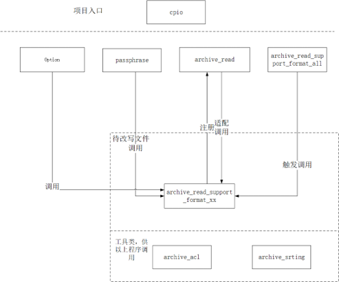
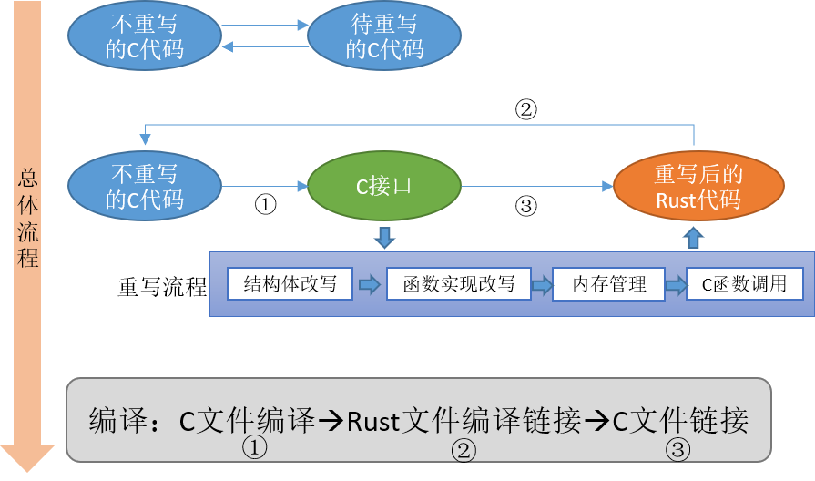

# libarchive-rust

#### 介绍
Libarchive历史安全漏洞较多，其中内存漏洞在两个项目漏洞中分别占比75%，产生这些安全漏洞或与这些安全漏洞相关的模块称为高危模块。本项目拟通过Rust语言重写libarchive库的这些高危模块，利用Rust语言自身的内存安全机制修复这些安全漏洞，增加两个库的安全性和可靠性。

本项目主要改写的模块包括：

（1）int archive_read_support_format_XX(struct archive *_a)系列方法

（2）archive_read_support_format_all(struct archive *a)

（3）archive_string.c

（4）archive_acl.c


#### 软件架构



上图展示了libarchive项目中各个模块之间的关系，以及本项目中改写部分与不改写部分之间的关系。

#### 本项目重写方案与计划




#### 安装教程

准备make,cmake,rust等环境。版本推荐：       
- cmake:3.10
- make: 3.8  
- rust：最新稳定版

安装步骤如下：
1. 通过gitee 获取代码  git clone git@gitee.com:lcynju/libarchive-rust.git
2. 运行libarchive-3.5.2-openEuler22.03-LTS-Next/build.sh编译代码
3. 运行make insatll 将代码安装到系统中

#### 使用说明

1. 命令行工具
libarchive-rust 提供了了3个命令行工具，分别为：bsdtar、bsdcat、bsdcpio 可以使用bsdxx --help 查询具体使用方式
如：
```shell
# bsdcpio --help
bsdcpio: manipulate archive files
First option must be a mode specifier:
  -i Input  -o Output  -p Pass
Common Options:
  -v Verbose filenames     -V  one dot per file
Create: bsdcpio -o [options]  < [list of files] > [archive]
  -J,-y,-z,--lzma  Compress archive with xz/bzip2/gzip/lzma
  --format {odc|newc|ustar}  Select archive format
List: bsdcpio -it < [archive]
Extract: bsdcpio -i [options] < [archive]
bsdcpio 3.4.2 - libarchive 3.4.2 zlib/1.2.11 liblzma/5.2.5 bz2lib/1.0.8 liblz4/1.9.2 libzstd/1.4.4 
```

2. 代码内使用
通过引入archive.h,archive_entry.h 使用libarchive库。其解压端调用代码如下：

```c++
int r;
ssize_t size;

struct archive *a = archive_read_new();
archive_read_support_filter_all(a);
archive_read_support_format_raw(a);
r = archive_read_open_filename(a, filename, 16384);
if (r != ARCHIVE_OK) {
  /* ERROR */
}
r = archive_read_next_header(a, &ae);
if (r != ARCHIVE_OK) {
  /* ERROR */
}

for (;;) {
  size = archive_read_data(a, buff, buffsize);
  if (size < 0) {
    /* ERROR */
  }
  if (size == 0)
    break;
  write(1, buff, size);
}

archive_read_free(a);
```
rust库作为libarchive的依赖不单独对外提供服务 libarchive-rust的使用方式与libarchive基本相同，更多使用方式可以参考：https://github.com/libarchive/libarchive

#### 参与贡献

1.  Fork 本仓库
2.  新建 Feat_xxx 分支
3.  提交代码
4.  新建 Pull Request


#### 特技

1.  使用 Readme\_XXX.md 来支持不同的语言，例如 Readme\_en.md, Readme\_zh.md
2.  Gitee 官方博客 [blog.gitee.com](https://blog.gitee.com)
3.  你可以 [https://gitee.com/explore](https://gitee.com/explore) 这个地址来了解 Gitee 上的优秀开源项目
4.  [GVP](https://gitee.com/gvp) 全称是 Gitee 最有价值开源项目，是综合评定出的优秀开源项目
5.  Gitee 官方提供的使用手册 [https://gitee.com/help](https://gitee.com/help)
6.  Gitee 封面人物是一档用来展示 Gitee 会员风采的栏目 [https://gitee.com/gitee-stars/](https://gitee.com/gitee-stars/)